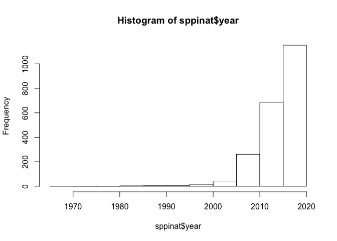
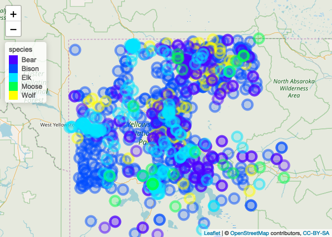
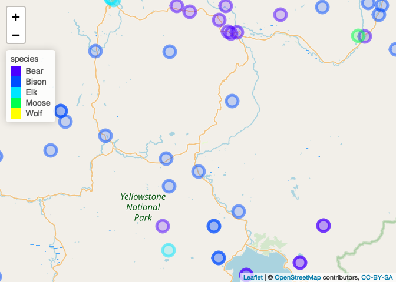

yellowstone
================

##### install packages

    ## 
    ## Attaching package: 'data.table'

    ## The following object is masked from 'package:raster':
    ## 
    ##     shift

    ## Loading required package: lattice

    ## Loading required package: ggplot2

    ## 
    ## Attaching package: 'lubridate'

    ## The following objects are masked from 'package:data.table':
    ## 
    ##     hour, isoweek, mday, minute, month, quarter, second, wday,
    ##     week, yday, year

    ## The following object is masked from 'package:base':
    ## 
    ##     date

    ## Loading required package: rgdal

    ## rgdal: version: 1.3-9, (SVN revision 794)
    ##  Geospatial Data Abstraction Library extensions to R successfully loaded
    ##  Loaded GDAL runtime: GDAL 2.1.3, released 2017/20/01
    ##  Path to GDAL shared files: /Library/Frameworks/R.framework/Versions/3.4/Resources/library/rgdal/gdal
    ##  GDAL binary built with GEOS: FALSE 
    ##  Loaded PROJ.4 runtime: Rel. 4.9.3, 15 August 2016, [PJ_VERSION: 493]
    ##  Path to PROJ.4 shared files: /Library/Frameworks/R.framework/Versions/3.4/Resources/library/rgdal/proj
    ##  Linking to sp version: 1.3-1

    ## 
    ## Attaching package: 'dplyr'

    ## The following objects are masked from 'package:lubridate':
    ## 
    ##     intersect, setdiff, union

    ## The following objects are masked from 'package:data.table':
    ## 
    ##     between, first, last

    ## The following objects are masked from 'package:raster':
    ## 
    ##     intersect, select, union

    ## The following objects are masked from 'package:stats':
    ## 
    ##     filter, lag

    ## The following objects are masked from 'package:base':
    ## 
    ##     intersect, setdiff, setequal, union

    ## Loading required package: Matrix

    ## rgeos version: 0.4-2, (SVN revision 581)
    ##  GEOS runtime version: 3.6.1-CAPI-1.10.1 
    ##  Linking to sp version: 1.3-1 
    ##  Polygon checking: TRUE

    ## Loading required package: deldir

    ## deldir 0.1-15

    ## Loading required package: ade4

    ## Loading required package: adehabitatMA

    ## 
    ## Attaching package: 'adehabitatMA'

    ## The following object is masked from 'package:raster':
    ## 
    ##     buffer

    ## Loading required package: adehabitatLT

    ## Loading required package: CircStats

    ## Loading required package: MASS

    ## 
    ## Attaching package: 'MASS'

    ## The following object is masked from 'package:dplyr':
    ## 
    ##     select

    ## The following objects are masked from 'package:raster':
    ## 
    ##     area, select

    ## Loading required package: boot

    ## 
    ## Attaching package: 'boot'

    ## The following object is masked from 'package:lattice':
    ## 
    ##     melanoma

    ## 
    ## Attaching package: 'adehabitatLT'

    ## The following object is masked from 'package:dplyr':
    ## 
    ##     id

    ## 
    ## Attaching package: 'magrittr'

    ## The following object is masked from 'package:raster':
    ## 
    ##     extract

    ## Loading required package: survival

    ## 
    ## Attaching package: 'survival'

    ## The following object is masked from 'package:boot':
    ## 
    ##     aml

    ## The following object is masked from 'package:caret':
    ## 
    ##     cluster

    ## Loading required package: splines

    ## Loading required package: parallel

    ## Loaded gbm 2.1.3

    ## 
    ## Attaching package: 'geojsonio'

    ## The following object is masked from 'package:base':
    ## 
    ##     pretty

    ## Linking to GEOS 3.6.1, GDAL 2.1.3, PROJ 4.9.3

    ## Loading required package: snowfall

    ## Loading required package: snow

    ## 
    ## Attaching package: 'snow'

    ## The following objects are masked from 'package:parallel':
    ## 
    ##     clusterApply, clusterApplyLB, clusterCall, clusterEvalQ,
    ##     clusterExport, clusterMap, clusterSplit, makeCluster,
    ##     parApply, parCapply, parLapply, parRapply, parSapply,
    ##     splitIndices, stopCluster

    ## Loading required package: fields

    ## Loading required package: spam

    ## Loading required package: dotCall64

    ## Loading required package: grid

    ## Spam version 2.1-4 (2018-04-12) is loaded.
    ## Type 'help( Spam)' or 'demo( spam)' for a short introduction 
    ## and overview of this package.
    ## Help for individual functions is also obtained by adding the
    ## suffix '.spam' to the function name, e.g. 'help( chol.spam)'.

    ## 
    ## Attaching package: 'spam'

    ## The following object is masked from 'package:Matrix':
    ## 
    ##     det

    ## The following objects are masked from 'package:base':
    ## 
    ##     backsolve, forwardsolve

    ## Loading required package: maps

    ## See www.image.ucar.edu/~nychka/Fields for
    ##  a vignette and other supplements.

#### read in protected area data. source: <https://gapanalysis.usgs.gov/padus/data/download/>

``` r
path = "PAD/"
shp = shapefile(paste0(path,
                       "PADUS1_4Combined.shp"))
state = "WY"
shp_state = subset(shp, State_Nm == state)

uname = sort(shp_state$Loc_Nm, decreasing=TRUE)
loc = "Yellowstone"#this is smaller than "YELL"
loc = "YELL"#

shp_loc = subset(shp_state, Loc_Nm == loc)
save(shp_loc, file = "shp_loc.Rdata")
```

iNaturalist data
----------------

#### get records for each species from iNaturalist

``` r
# ## Return just records from iNaturalist for one species

load("shp_loc.Rdata")
proj_new = "+proj=longlat +datum=WGS84 +no_defs+ellps=WGS84 +towgs84=0,0,0"
#https://stackoverflow.com/questions/30018098/how-to-convert-utm-coordinates-to-lat-and-long-in-r
shp_loc_t <- spTransform(shp_loc, CRS(proj_new))
#projection(shp_loc) <- CRS()
#bbox_tmp = bbox(shp_loc_t)
bbox = as.data.frame(bbox(shp_loc_t))

out = NULL
species_list = c("Bison bison",
                 "Bison bison bison",
                 "Canis lupus",
                 "Ursus arctos",
                 "Ursus arctos horribilis",
                 "Ursus americanus",
                 "Cervus canadensis",
                 "Alces alces")
for (a in 1:length(species_list)){
  species = species_list[a]
  sppinat <- get_inat_obs(taxon_name = species, maxresults = 100000)
  
  #not doing this version because it doesn't return any results
  # sppinat <- get_inat_obs(taxon_name = species, maxresults = 100000,
  #                       bounds = c(bbox$min[2],
  #                                  bbox$max[2],
  #                                  bbox$min[1],
  #                                  bbox$max[1]))

  #remove duplicates if there are any
  occs.dups <- duplicated(sppinat[c('latitude', 'longitude', 'datetime')])
  sppinat <- sppinat[!occs.dups,]
  dim(sppinat)

  out = rbind(out, sppinat)
}
#out_all = out
out <- subset(out, latitude >= bbox$min[2] 
                & latitude <= bbox$max[2]
                & longitude >= bbox$min[1]
                & longitude <= bbox$max[1])
# table(sppinat$scientific_name, sppinat$common_name)

#minimum fields: datetime, latitude, longitude, scientific_name
out = out[, c("common_name", "scientific_name", "datetime", "latitude", "longitude", "quality_grade", "user_login")]

#confirm that there does not appear to be any spatial pattern for iNat data that is research grade versus less-than-research-grade
# plot <- ggplot(data = sppinat, aes(x = longitude, y = latitude, group = quality_grade))+
#   geom_point(aes(color = factor(quality_grade)), alpha = 0.5)
# 
# plot
out$institutionCode = "iNaturalist"

sppinat = out
#fix datetime
sppinat$datetime = strptime(sppinat$datetime, format = "%Y-%m-%d %H:%M:%S", tz = "")
sppinat$datetime = strftime(sppinat$datetime, format = "%Y-%m-%d %H:%M:%S", tz = "", usetz = FALSE)
sppinat$date = as.Date(sppinat$datetime)
sppinat$month = month(sppinat$date)
sppinat$year = year(sppinat$date)
sppinat$day = day(sppinat$date)
min(sppinat$year, na.rm=TRUE)
```

    ## [1] 1965

``` r
max(sppinat$year, na.rm = TRUE)
```

    ## [1] 2019

``` r
hist(sppinat$year)
```



``` r
# sppinat_recent = subset(sppinat, year >= 2005 & year <=2019)
# save(sppinat_recent, file = "sppinat_recent.Rdata")
sppinat$common_name_simplified = ""

animal = c("Wapiti", "American Elk", "Roosevelt Elk")
inds = which(sppinat$common_name %in% animal)
sppinat$common_name_simplified[inds]="Elk"

animal = c("American Bison", "Plains Bison")
inds = which(sppinat$common_name %in% animal)
sppinat$common_name_simplified[inds]="Bison"

animal = c("Northwestern Wolf", "Gray Wolf")
inds = which(sppinat$common_name %in% animal)
sppinat$common_name_simplified[inds]="Wolf"

animal = c("Grizzly Bear", "Brown Bear", "American Black Bear",
           "Eastern Black Bear", "Olympic Black Bear")
inds = which(sppinat$common_name %in% animal)
sppinat$common_name_simplified[inds]="Bear"


animal = c("Moose")
inds = which(sppinat$common_name %in% animal)
sppinat$common_name_simplified[inds]="Moose"

unique(sppinat$common_name_simplified)
```

    ## [1] "Bison" "Wolf"  "Bear"  "Elk"   "Moose"

``` r
sppinat$year_month = paste(sppinat$year, sppinat$month)
save(sppinat, file = "sppinat.Rdata")
df_sum <- sppinat %>% group_by(year_month) %>%
  mutate(num_species = length(unique(common_name_simplified)))

df_5 <- subset(df_sum, num_species == 5)
```

#### make map of big five species from iNaturalist

``` r
df <- df_5
factpal <- colorFactor(topo.colors(5), df$common_name_simplified)
zoom = 9
M<-    leaflet(df) %>%
      addTiles() %>%
       setView(lng = mean(df$longitude), lat = mean(df$latitude) , zoom =zoom) %>%
      addCircleMarkers(lng = df$longitude,
                       lat = df$latitude,
                 #color = color.vec[df$taxon_num],
                 color = ~factpal(common_name_simplified)) %>%
                    addLegend("topleft", pal = factpal, values = ~df$common_name_simplified, opacity = 1.0, title = "species")
                        # label = htmlEscape(paste(df$organism_type, df$species))
                 #label appears on hover

mapshot(M, file = "yellowstone_big_5.png")
M
```



#### make heatmap of one species (wolf) for one month (June)

``` r
df <- subset(sppinat, common_name_simplified == "Wolf" & month == 6)

require(MASS)
# dens <- kde2d(df$longitude, df$latitude, h=75, n=50)  #overrode default bandwidth
dens <- kde2d(df$longitude, df$latitude)  #overrode default bandwidth
filled.contour(dens)
```


#### show all the data for one month (June) in 2018

``` r
zoom = 9
load("sppinat.Rdata")
df <- subset(sppinat, year == 2018 & month == 6)

factpal <- colorFactor(topo.colors(5), df$common_name_simplified)

M<-  leaflet(df) %>%
      addTiles() %>%
       setView(lng = mean(df$longitude), lat = mean(df$latitude) , zoom =zoom) %>%
      addCircleMarkers(lng = df$longitude,
                       lat = df$latitude,
                 #color = color.vec[df$taxon_num],
                 color = ~factpal(common_name_simplified)) %>%
                    addLegend("topleft", pal = factpal, values = ~df$common_name_simplified, opacity = 1.0, title = "species")
                        # label = htmlEscape(paste(df$organism_type, df$species))
                 #label appears on hover

mapshot(M, file = "yellowstone_big_5_June_2018.png")
M
```



Flickr
------

##### install using py\_install

    ## virtualenv: ~/.virtualenvs/r-reticulate 
    ## Upgrading pip ...
    ## Upgrading wheel ...
    ## Upgrading setuptools ...
    ## Installing packages ...
    ## 
    ## Installation complete.

##### import python packages

``` r
flickrapi <- import("flickrapi")
```

##### import flickrapi, load keys in python, do search for wolf in Yellowstone

Note this only gets one page of results, so it's hard to know how useful it is. Need to find out how to get all the pages.

``` python
#####################################################################################
#import packages
import flickrapi
import pandas as pd
import csv
#####################################################################################
#key and secret
api_key_file = "/Users/fischhoff/ilya documents/R/social_biodiv/flickr_api_key.txt"
with open(api_key_file, "r") as keyfile:
    api_key = keyfile.read()
api_key
#get secret
api_secret_file = "/Users/fischhoff/ilya documents/R/social_biodiv/flickr_api_secret.txt"
with open(api_secret_file, "r") as keyfile:
    secret_api_key = keyfile.read()
#####################################################################################
#do search
#https://www.flickr.com/groups/51035612836@N01/discuss/72157668638670202/
flickr = flickrapi.FlickrAPI(api_key, secret_api_key, format='parsed-json')
extras='url_m,geo,tags,owner_name,date_taken,date_upload,description'
#bbox
LLX = -111.0569#bbox$min[1]
LLY = 44.13245#bbox$min[2]
URX= -109.8242#bbox$max[1]
URY = 45.0039#bbox$max[2]
bb = str(LLX) + ',' + str(LLY) + ',' + str(URX) + ',' + str(URY)
query = 'wolf'
#search
page_no = 1
parameters = { 'bbox': bb, 
'tags': query, 
#'tag_mode':'all', #note: if using tag_mode: all then comment out tags: query
'per_page':250, 
'page': page_no, 
'has_geo':1, 
'accuracy':14,
'extras': extras}
init = flickr.photos.search(**parameters)
pages = init['photos']['pages']
print(pages)
```

    ## 4

``` python
total = init['photos']['total']
print(total)
#####################################################################################
#output to csv
```

    ## 757

``` python
df = pd.DataFrame.from_dict(init)
d = df['photos']['photo']
#print(list(d))
d_first_page= pd.DataFrame.from_records(d, columns = ['id', 'owner', 'description', 'latitude', 'longitude', 'datetaken'])
d_first_page.to_csv('flickr.wolf.csv')
```

#### check if flickr gave additional images relative to iNaturalist for wolves

``` r
load("sppinat.Rdata")
flickr_wolf <- read.csv("flickr.wolf.csv")
names(flickr_wolf)
```

    ## [1] "X"           "id"          "owner"       "description" "latitude"   
    ## [6] "longitude"   "datetaken"

``` r
fw <-  flickr_wolf
fw$date = as.Date(fw$datetaken)
fw$year = year(fw$date)
fw$month = month(fw$date)
```

Twitter
-------

Returns few records (wolves, bison) or none (moose, bear)

``` r
#https://apps.twitter.com/app/15434357
#https://cran.r-project.org/web/packages/rtweet/vignettes/intro.html
#install.packages("twitteR")
library(twitteR)
```

    ## 
    ## Attaching package: 'twitteR'

    ## The following object is masked from 'package:adehabitatLT':
    ## 
    ##     id

    ## The following objects are masked from 'package:dplyr':
    ## 
    ##     id, location

``` r
# Change the next four lines based on your own consumer_key, consume_secret, access_token, and access_secret. 
#key and secret
#instagram_api_key.txt contains only api key
consumer_api_key_file = readtext("twitter_api_key.txt")
consumer_api_key = consumer_api_key_file$text
#get secret

consumer_api_secret_file = readtext("twitter_secret.txt")
consumer_api_secret = consumer_api_secret_file$text

access_key_file = readtext("twitter_access_token.txt")
access_key = access_key_file$text

access_key_secret_file = readtext("twitter_access_token_secret.txt")
access_key_secret = access_key_secret_file$text

consumer_key <- consumer_api_key
consumer_secret <- consumer_api_secret
access_token <- access_key
access_secret <- access_key_secret

setup_twitter_oauth(consumer_key, consumer_secret, access_token, access_secret)
```

    ## [1] "Using direct authentication"

``` r
X = mean(c(bbox$min[1], bbox$max[1]))#approx x and y
Y = mean(c(bbox$min[2], bbox$max[2]))

# tw = searchTwitter('#wolves', n = 1e4, since = '2010-01-01', retryOnRateLimit = 1e3, geocode = paste(Y, X, "50km", sep = ","))
# d = twListToDF(tw)

#dim(d)

# tw = searchTwitter('#moose', n = 1e4, since = '2010-01-01', retryOnRateLimit = 1e3, geocode = paste(Y, X, "50km", sep = ","))
# d = twListToDF(tw)

# tw = searchTwitter('#bear', n = 1e4, since = '2010-01-01', retryOnRateLimit = 1e3, geocode = paste(Y, X, "50km", sep = ","))
# d = twListToDF(tw)

# tw = searchTwitter('#bison', n = 1e4, since = '2010-01-01', retryOnRateLimit = 1e3, geocode = paste(Y, X, "50km", sep = ","))
# d = twListToDF(tw)


# Tmap <- leaflet(d) %>%
#   addTiles() %>%
#       setView(lat = Y, lng=X, zoom =10) %>%
#   addCircleMarkers(lng=t$longitude, lat = t$latitude, fillOpacity = 0.15, opacity =0.0, 
#                    radius = 5,
#                    color =~pal(as.numeric(as.factor(t$iconic_taxon_name))),
#                                fillColor=~pal(as.numeric(as.factor(d$screenName)))
#                    )
# Tmap
```

### use rLandsat to get Landsat images associated with each animal location

commenting this out for now

``` r
# 
# load("sppinat_recent.Rdata")
# df = sppinat_recent
# udate = unique(df$date)
# a = 1
# tmp = subset(df, datetime == udate[a])
# min_date = tmp$date[1] - 7
# max_date = tmp$date[1] + 7
# # get all the product IDs for path and row
# result = landsat_search(min_date = min_date, 
#                         max_date = max_date, 
#                         country = NULL,
#                         path_master = 37,
#                         row_master = 29)
# #result
# 
# #use result to download images 
# source("landsat_download.R")
# 
# deg_interval = 0.1
# df <- df %>%
#   mutate(left = longitude - deg_interval,
#          top = latitude + deg_interval,
#          right = longitude+deg_interval,
#          bottom = latitude - deg_interval)
# df$index = seq(1, dim(df)[1])
```
